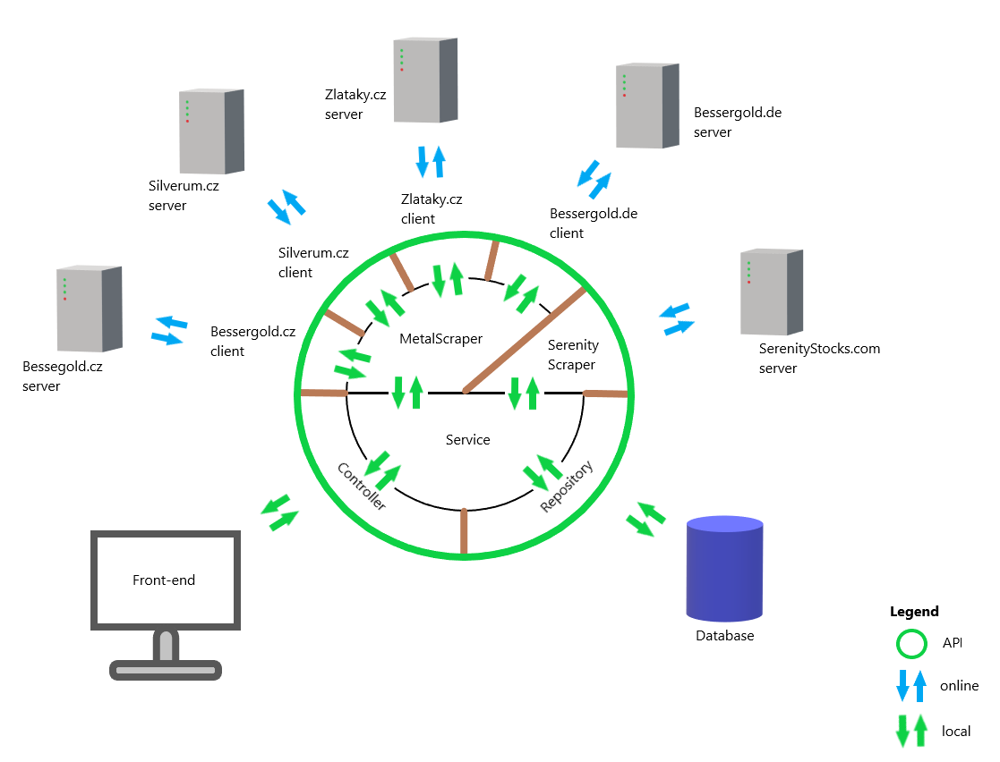

# Investment Scrap App

## How to run on local machine?
#### Database
>`cd src/main/docker` 
>`docker build .` 
>`docker compose up`
#### Backend application
>Make sure your device has access to internet. 
>Run <b>main method in InvestmentScraperApp.java</b> 
>Initial actions, like data scraping,
> can be handled by <b>EventListeners in Run.java</b>
#### Frontend application
>Enter client directory  
>`yarn install` 
>`yarn start` 
 

## Server deployment

#### Commands
><b>Login</b> to server 
>`sudo ssh -v -p 22 root@67.223.117.163`

> <b>Backup DB</b> on server 
> `nano app/postgres_data_dump/README.txt`

> <b>Copy DB</b> dump from server to local machine 
>`scp root@67.223.117.163:/root/app/postgres_data_dump/14-04-24-after-clean-up.sql .`

> <b>Restore DB</b> from local machine 
>`psql -U postgres -p 5432 -h 67.223.117.163 -d goldSilver < 25_04_24_product_synchronization.dump`

> [useful SQL commands](request.sql)  

#### Tips
> Lack of memory in Docker 
> [docker system prune](https://docs.docker.com/reference/cli/docker/system/prune/)
> <b>BACKUP Postgres</b> BEFORE this command !!!!

> After FE deployment, open app in new tab. Otherwise, changes won't take place.
 

## Technology stack 
#### Backend stack
> Java Springboot Hibernate Maven Docker PostgreSQL 
>
#### Frontend stack
> ReactJS JavaScript/TypeScript Material-UI 
 

## Introduction
> Smyslem algoritmu je zprostředkovat informace o investičních produktech.  
Program vyhodnocuje nabídku drahých kovů na českém trhu.  
Zároveň získává informace ze stránky, která vyhodnocuje akcie na základě 
strategie popsané v knize <b> Inteligentní Investor</b> od Benjamina Grahama

### Relevant articles
> https://www.silverum.cz/pruvodce-investora.html  
https://www.grahamvalue.com/article/how-build-complete-benjamin-graham-portfolio  
https://en.wikipedia.org/wiki/Benjamin_Graham  
https://en.wikipedia.org/wiki/The_Intelligent_Investor  
 

## Data gathering
> Získání dat zajišťují třídy `scrap`
Program se pomocí `htmlunit` klienta spojí s webovou stránkou a na základě `XPath` získá z dokumentu relevantní data. 
Ty jsou následné použity k vytvoření entit `stockGraham` či `product` a uloženy do databáze.

> Informace pro `stockGraham` jsou získány z www.serenitystocks.com/stockGraham/ +`ticker`
Databáze uchovává seznam tickerů (zkratek užívaných na burze) a jejich stav. 
Jejich zdrojem jsou soubory v adresáři `txt/`

>Drahé kovy jsou reprezentovány entitou `product` s relací na `link` a `pricePair` 
Na základě link adresy je zjištěna cena, váha, výrobce atd.

### Data sources
> https://www.serenitystocks.com 
https://www.bessergold.cz 
https://www.bessergold.de 
https://zlataky.cz 
https://silverum.cz 

 

## Application interface

> Data je možné získat na http://localhost:8080/api/v2/ +`entita` Jsou poskytovány ve formátu JSON.
Entity jsou k dispozici v optimalizovaném formátu `DTO` (Data Transfer Object).

### Swagger
> http://localhost:8080/swagger-ui/

### DTO
> V aplikaci jsou používány Data Transfer Objects, aby se šetřil datový přenos mezi aplikacemi a minimalizovalo množství dat, se kterými se manipuluje.

 

## User interface

### Product table

### Product detail

### Portfolios

### Analytics

