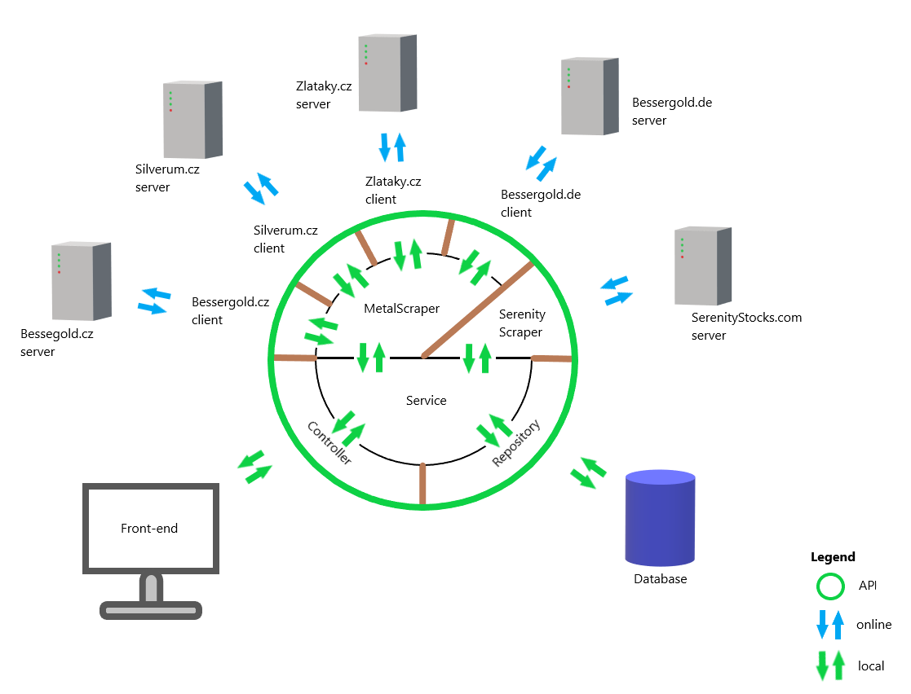

# Investment Scrap App server

## How to run?
>### Database
>* cd src/main/docker 
>* docker build . 
>* docker compose up
>### Back-end application
>Make sure your device has access to internet. 
>Run <b>main method in InvestmentScraperApp.java</b> 
>Initial actions, like data scraping,
> can be handled by <b>EventListeners in Run.java</b>
>### Front-end application
>Enter client directory
>* yarn install 
>* yarn start 

## Tech stack 
> ### BE
> Java Springboot Hibernate Maven Docker PostgreSQL 

> ### FE
> ReactJS JavaScript/TypeScript Material-UI 

## Úvod
> Smyslem algoritmu je zprostředkovat informace o investičních produktech.  
Program vyhodnocuje nabídku drahých kovů na českém trhu.  
Zároveň získává informace ze stránky, která vyhodnocuje akcie na základě 
strategie popsané v knize <b> Inteligentní Investor</b> od Benjamina Grahama

## Získání dat
> Získání dat zajišťují třídy `scrap`
Program se pomocí `htmlunit` klienta spojí s webovou stránkou a na základě `XPath` získá z dokumentu relevantní data. 
Ty jsou následné použity k vytvoření entit `stock` či `product` a uloženy do databáze.

> Informace pro `stock` jsou získány z www.serenitystocks.com/stock/ +`ticker`
Databáze uchovává seznam tickerů (zkratek užívaných na burze) a jejich stav. 
Jejich zdrojem jsou soubory v adresáři `txt/`

>Drahé kovy jsou reprezentovány entitou `product` s relací na `link` a `pricePair` 
Na základě link adresy je zjištěna cena, váha, výrobce atd.

### Zdroje dat
https://www.serenitystocks.com 
https://www.bessergold.cz 
https://www.bessergold.de 
https://zlataky.cz 
https://silverum.cz 

## Aplikační rozhraní

Data je možné získat na http://localhost:8080/api/v2/ +`entita` Jsou poskytovány ve formátu JSON.
Entity jsou k dispozici v optimalizovaném formátu `DTO` (Data Transfer Object).

### DTO
V aplikaci jsou používány Data Transfer Objects, aby se šetřil datový přenos mezi aplikacemi a minimalizovalo množství dat, se kterými se manipuluje.

 

### Relevantní články
https://www.serenitystocks.com/article/how-build-complete-benjamin-graham-portfolio  
https://en.wikipedia.org/wiki/Benjamin_Graham  
https://en.wikipedia.org/wiki/The_Intelligent_Investor  
https://www.silverum.cz/pruvodce-investora.html  
